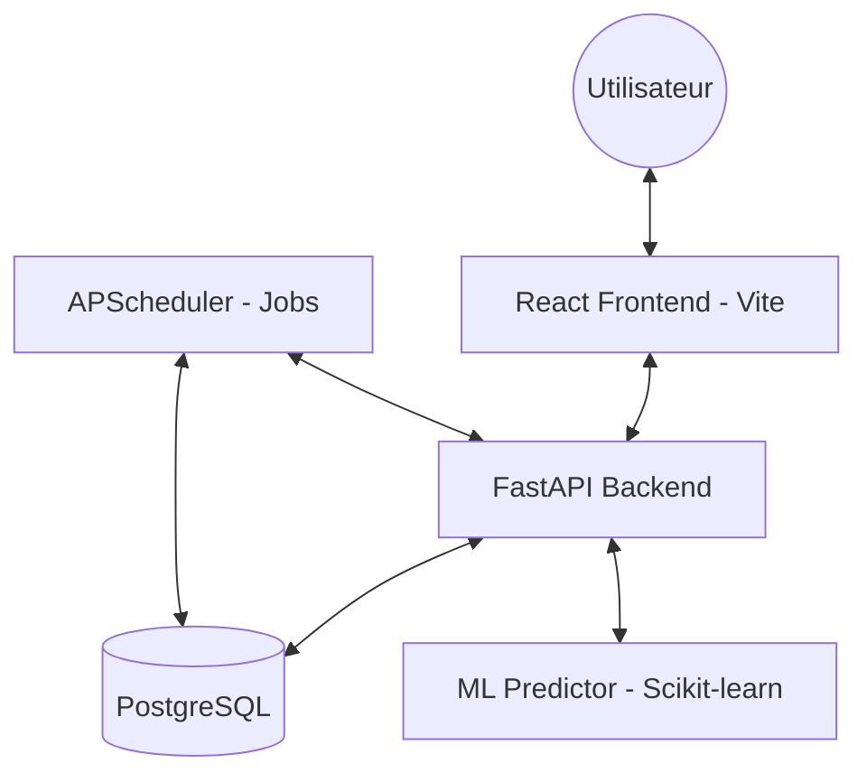

# FinSight DZ — AI-Powered Banking & Finance Dashboard

FinSight DZ is a full-stack web application that simulates an Algerian digital banking dashboard enhanced with AI-powered financial insights and ML-based spending predictions. Inspired by CCP (Algeria Post), BNA, BEA, and Crédit Populaire d'Algérie account logic, this project provides a comprehensive financial portfolio and simulation tool tailored to the Algerian Dinar (DA / DZD).

## Features
- **Accounts & Transactions:** Manage CCP, Epargne, CPA, and Business accounts with robust business rules (e.g., no overdraft on CCP, ATM withdrawal multiples).
- **Dashboard & Visualization:** Interactive charts powered by Recharts (Category breakdown, Monthly income/expense, etc.).
- **Smart Categorization:** Auto-categorizes transactions based on keyword rules tailored to the Algerian market (Sonelgaz, ADE, Mobilis, Yassir, etc.).
- **AI Financial Insights:** Generates personalized insights comparing your spending against cost-of-living benchmarks for Algiers, alerting on overspending, savings rate improvements, and contextual events (like Ramadan).
- **ML Predictions:** Predicts next month's expenses and account balance using a linear regression model trained on historical data.
- **Budgeting:** Set and track budgets across different categories and periods.

## Tech Stack
- **Backend:** Python 3.11, FastAPI, SQLAlchemy, PostgreSQL, Alembic, Scikit-learn, APScheduler
- **Frontend:** React 18, Vite, TailwindCSS, Zustand, Recharts, Radix UI
- **Infrastructure:** Docker Compose

## Repository Structure
- `backend/`: FastAPI application, ML predictor, Background Jobs, DB models, and API routers.
- `frontend/`: React + Vite application, UI components, state management, and API clients.

## Build & Run Instructions

### Prerequisites
- Docker & Docker Compose
- Node.js (for local frontend development)
- Python 3.11 (for local backend development)

### Setup & Installation
1. **Clone the repository:**
   ```bash
   git clone https://github.com/yourname/finsight-dz
   cd finsight-dz
   ```
2. **Environment Variables:**
   Copy the example environment file:
   ```bash
   cp .env.example .env
   ```
3. **Start Database and Backend:**
   We use Docker to run the PostgreSQL database.
   ```bash
   docker-compose up -d db
   ```
   *Optional:* If you want to run the backend natively:
   ```bash
   cd backend
   pip install -r requirements.txt
   alembic upgrade head
   python -m app.seed.seed_categories
   uvicorn app.main:app --reload
   ```
   *Otherwise, start everything using Docker:*
   ```bash
   docker-compose up -d
   ```
4. **Start Frontend:**
   ```bash
   cd frontend
   npm install
   npm run dev
   ```

### Accessing the App
- **Frontend Application:** http://localhost:5173
- **Backend API & Docs:** http://localhost:8000/docs
- **Database:** PostgreSQL on `localhost:5432`

## Project Architecture



- **Auth:** JWT Bearer token authentication.
- **Insights Engine:** Business rule aggregation (9 rules) for real-time financial advice.
- **Background Tasks:** APScheduler runs daily to generate insights, settle pending transfers (T+2), and retrain ML models weekly.
- **Database Management:** Alembic handles database schema migrations.
- **ML Forecast:** Linear regression for 6-month balance and expense projections.

## Disclaimer
This project is a simulation and portfolio piece. It does not integrate with real bank APIs, payment gateways, or process real financial transactions.
